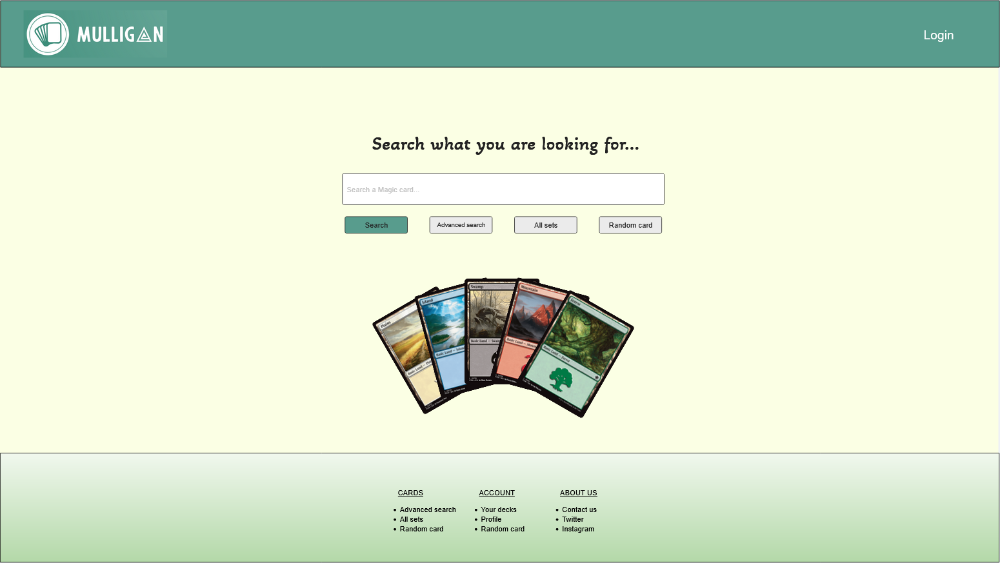
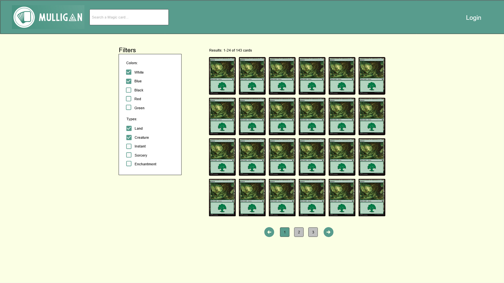
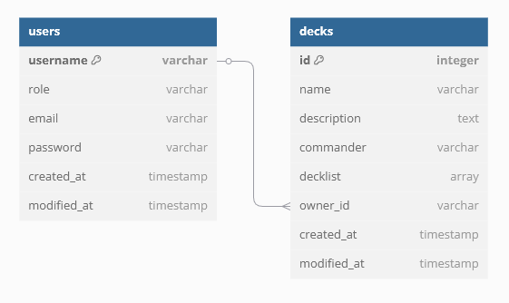

## mulligan.gg

mulligan.gg es una aplicación web de gestión de mazos para juegos de cartas coleccionables. En ella se podrá buscar información sobre las cartas del juego Magic the Gathering, crear lista de mazos y compartirlas con aquellos que quieran.

## Acceso a Trello

[Tablero en Trello](https://trello.com/b/MpaacsfA/proyecto-intermodular)

## Estructura de la base de datos

## Dudas
